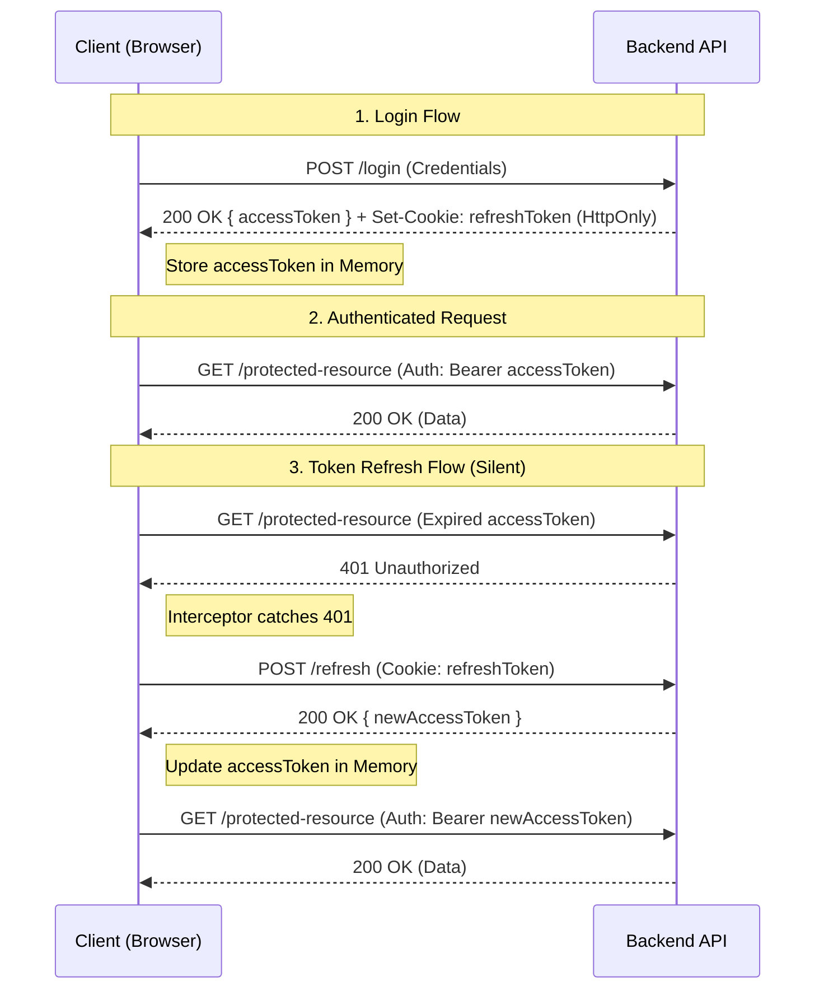

# Authentication Strategy: Secure JWT Implementation

## Executive Summary
To achieve the highest level of security for a Single Page Application (SPA) with a separate backend, the recommended strategy is **HttpOnly Cookies for Refresh Tokens** combined with **Short-lived In-Memory Access Tokens**.

This approach effectively neutralizes the most common XSS (Cross-Site Scripting) vectors that plague `localStorage` implementations while maintaining a stateless architecture.

## The Strategy

### 1. Token Storage & Lifecycle

| Token Type | Storage Location | Lifespan | Purpose |
| :--- | :--- | :--- | :--- |
| **Refresh Token** | **HttpOnly Cookie** | Long (e.g., 7 days) | Used *only* to obtain new access tokens. **Inaccessible to JavaScript.** |
| **Access Token** | **In-Memory** (React State/Context) | Short (e.g., 15 mins) | Used to authenticate API requests. Lost on page reload. |

### 2. The Authentication Flow

1.  **Login**:
    *   User sends credentials to `/api/login`.
    *   **Server**: Validates credentials.
        *   Sets a **Secure, HttpOnly, SameSite=Strict** cookie containing the `refresh_token`.
        *   Returns the `access_token` in the JSON response body.
    *   **Client**: Saves `access_token` in memory (e.g., AuthContext or Zustand store). **Do not persist this to localStorage.**

2.  **Authenticated Requests**:
    *   Client attaches `Authorization: Bearer <access_token>` to every API request.
    *   Since the access token is short-lived, the window of opportunity for a stolen token is minimal.

3.  **Token Refresh (Silent)**:
    *   When the `access_token` expires, the API returns `401 Unauthorized`.
    *   **Client (Axios Interceptor)**:
        *   Catches the 401.
        *   Calls `/api/refresh`. This request automatically includes the `HttpOnly` refresh token cookie.
        *   **Server**: Validates the cookie, checks for revocation, and issues a new `access_token`.
        *   **Client**: Updates the in-memory token and retries the original request.
    *   *Note*: On page reload, the app starts with no access token. It must immediately call `/api/refresh` to "restore" the session.

### 3. Visual Flow

## Security Analysis

### Preventing XSS (Cross-Site Scripting)
*   **The Problem**: If an attacker injects a script (XSS), they can read everything in `localStorage` and send your tokens to their server.
*   **The Solution**: With this strategy, the **Refresh Token** is in an `HttpOnly` cookie, which JavaScript *cannot read*. Even if an attacker runs code on your page, they cannot steal the persistence credential. They could theoretically scrape the in-memory Access Token, but it expires quickly (15 mins), limiting the damage.

### Preventing Man-in-the-Browser (MitB)
MitB attacks involve malware on the user's device modifying the browser's behavior. While difficult to fully prevent from the web app side, these measures significantly harden the application:
1.  **Content Security Policy (CSP)**: A strict CSP is your best defense. It restricts where scripts can be loaded from, preventing the injection of malicious external scripts.
    *   *Example*: `Content-Security-Policy: default-src 'self'; script-src 'self' https://trusted-analytics.com;`
2.  **Subresource Integrity (SRI)**: Ensure your CDN-hosted scripts haven't been tampered with.
3.  **Transactional Re-authentication**: For critical actions (e.g., changing password, transferring funds), require the user to re-enter their password. This defeats MitB scripts that might be piggybacking on the active session.

### CSRF (Cross-Site Request Forgery)
*   Since the **Access Token** is sent in a custom header (`Authorization`), standard CSRF attacks (which rely on browser cookie sending) cannot force a user to make an authenticated API call.
*   The `/refresh` endpoint uses cookies, so it *is* vulnerable to CSRF. However, modern browsers with `SameSite=Strict` cookies block most CSRF vectors. For maximum security, ensure the backend validates the `Origin` or `Referer` header on the refresh endpoint.

## Server Security Headers

These headers should be configured on the server (e.g., Nginx, Apache, or CloudFront) that serves the frontend application to provide defense-in-depth.

### Content-Security-Policy (CSP)
*   **Problem Solved**: Mitigates Cross-Site Scripting (XSS) and data injection attacks by restricting the sources from which the browser is allowed to load resources (scripts, styles, images, etc.).
*   **Recommendation**: `default-src 'self'; script-src 'self'; object-src 'none';` (Adjust `script-src` as needed for analytics/external libs).

### X-Frame-Options
*   **Problem Solved**: Prevents Clickjacking attacks by ensuring that your content is not embedded into other sites (e.g., via `<iframe>`).
*   **Recommendation**: `DENY` or `SAMEORIGIN`.

### X-Content-Type-Options
*   **Problem Solved**: Prevents "MIME sniffing" where the browser interprets files as a different MIME type than what is specified (e.g., executing a text file as JavaScript).
*   **Recommendation**: `nosniff`.

### Strict-Transport-Security (HSTS)
*   **Problem Solved**: Enforces the use of HTTPS. It tells the browser to automatically convert all HTTP requests to HTTPS and prevents the user from bypassing certificate errors.
*   **Recommendation**: `max-age=31536000; includeSubDomains; preload`.

### Referrer-Policy
*   **Problem Solved**: Controls how much information is included in the `Referer` header when navigating away from your document. Protects privacy and prevents leaking sensitive URL paths.
*   **Recommendation**: `strict-origin-when-cross-origin`.

### Permissions-Policy
*   **Problem Solved**: Allows you to explicitly disable powerful browser features (like geolocation, camera, microphone) that your site doesn't need, reducing the attack surface.
*   **Recommendation**: `geolocation=(), camera=(), microphone=()`.

## Implementation Checklist

### Backend Requirements
- [ ] **Cookie Configuration**:
    - `HttpOnly: true` (Critical)
    - `Secure: true` (Critical, requires HTTPS)
    - `SameSite: Strict` (Recommended) or `Lax`
    - `Path: /api/refresh` (Optional: limits cookie to specific endpoint)
- [ ] **Endpoints**:
    - `POST /login`: Returns Access Token + Sets Cookie.
    - `POST /refresh`: Reads Cookie + Returns new Access Token.
    - `POST /logout`: Clears Cookie.

### Frontend Requirements (React)
- [ ] **Auth Context**: Manage `accessToken` state.
- [ ] **Axios Interceptor**: Handle 401s and trigger refresh logic.
- [ ] **App Initialization**: Call `/refresh` on app mount to check if the user is already logged in.
